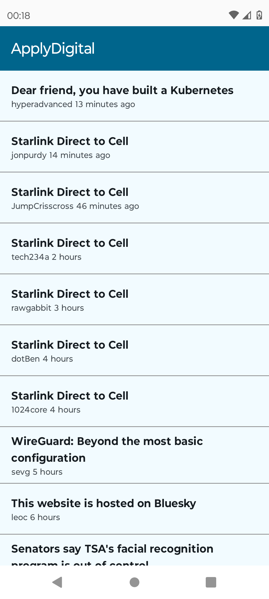

ApplyDigital
===========  

# Description  
This application allows you to read a news feed  

# Features  
You can delete news, and they won't appear in your feed again  
You can view pages in a webview  

# Screenshots  
<kbd>  
    
    
</kbd>  

# Architecture  
It is developed using the CLEAN architecture, which contains 3 packages:  

* Data: Connection to services  
* Domain: Repositories  
* Presentation: Activities, ViewModel, and composables  

# Libraries  
The following libraries were used:  

* Jetpack Compose  
* Retrofit  
* Moshi  
